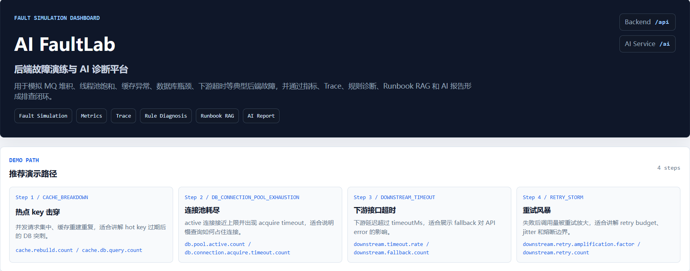
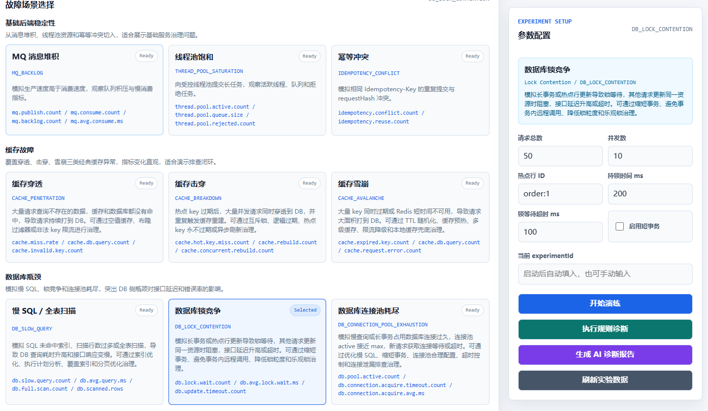
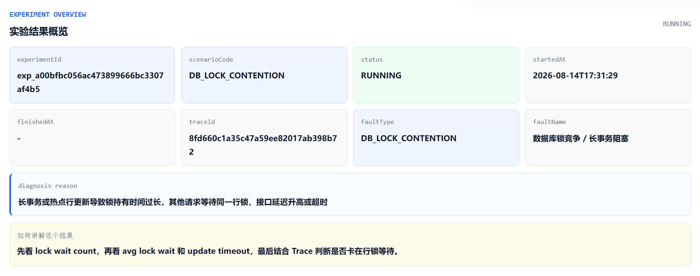
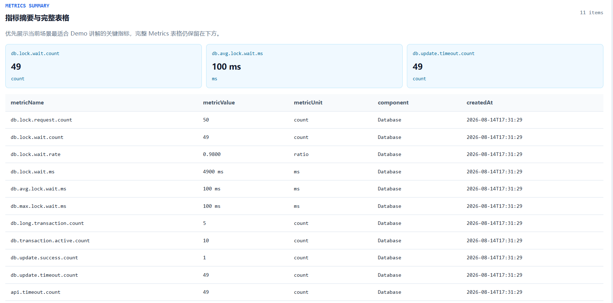
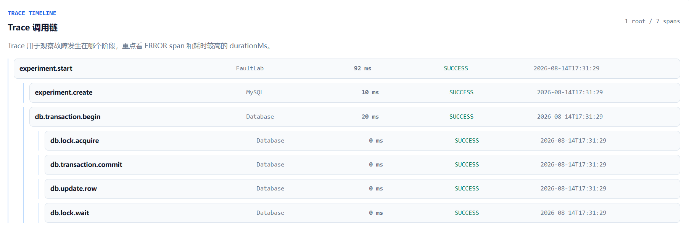
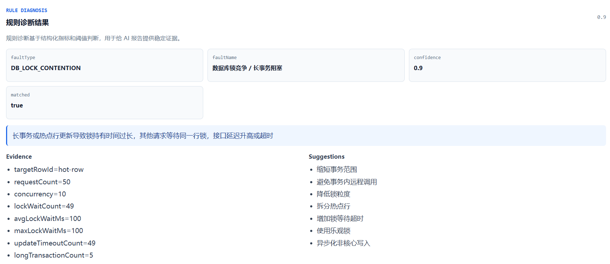
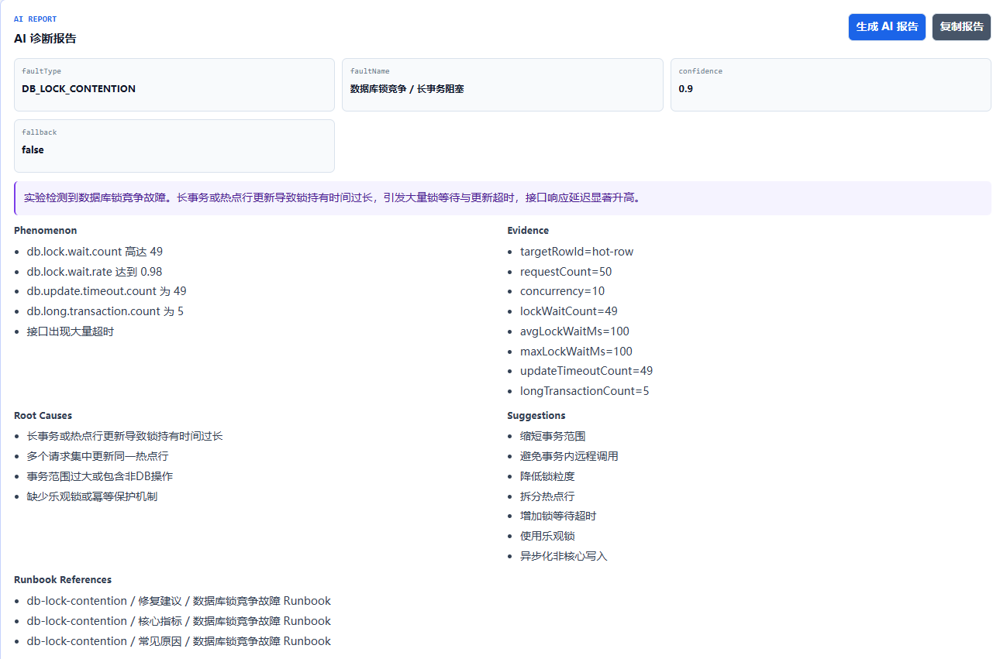
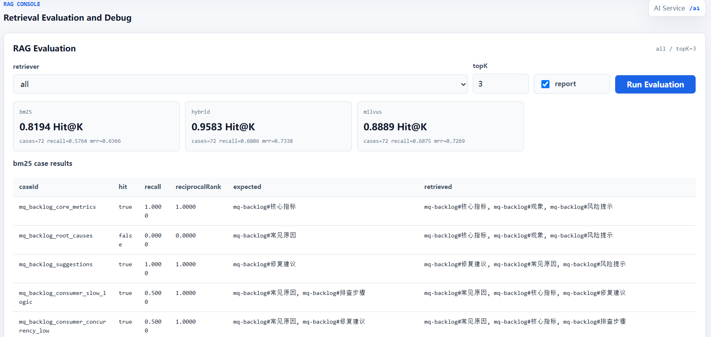
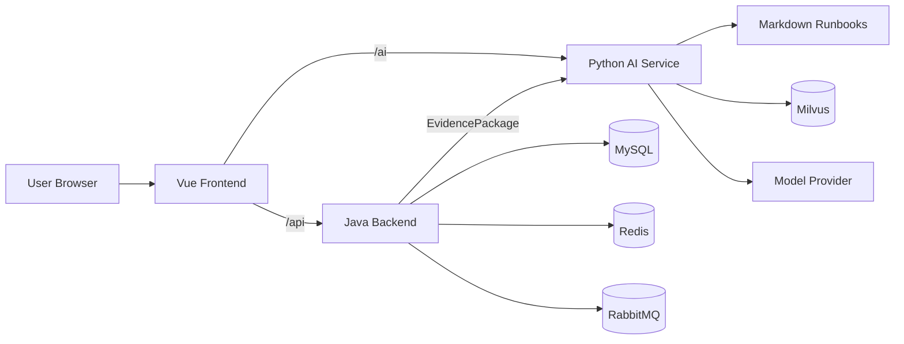
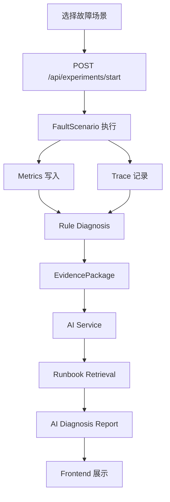

# AI FaultLab

后端故障演练与 AI 诊断学习平台

AI FaultLab 用于模拟典型 Java 后端故障，并通过 Metrics、Trace、规则诊断、Runbook RAG 和 AI 报告形成排查闭环。项目面向后端故障排查链路学习，支持本地完整运行和本地截图展示。

当前版本不提供公网在线 Demo。项目展示以 GitHub README、真实本地运行截图和本地启动文档为主。它是学习型 / Demo 工程，不是生产级故障注入平台，也不等同于生产 AIOps 系统。


## 项目能做什么

- Fault Simulation：模拟 MQ 堆积、线程池饱和、幂等冲突、缓存故障、数据库瓶颈和下游调用异常等典型后端问题。
- Metrics Collection：在故障演练过程中记录关键指标，例如 backlog、cache miss、DB query latency、retry amplification 等。
- Trace Recording：记录实验链路中的 root span 和 child spans，用于观察故障发生在哪个组件或阶段。
- Rule Diagnosis：根据稳定规则输出结构化诊断结果，保证即使 AI 不可用也能得到基础判断。
- EvidencePackage：由 Java Backend 汇总实验、指标、Trace 和规则诊断结果，作为 AI 诊断输入。
- Runbook RAG：从本地 Markdown Runbooks 中检索相关排查片段，为 AI 报告提供上下文。
- AI Diagnosis Report：Python AI Service 调用模型生成结构化诊断报告，并在失败时回退到规则诊断结果。
- Retrieval Evaluation：用评测集度量 Runbook 检索质量，支持 Hit@K、Recall@K 和 MRR。
- Frontend Demo Console：Vue 前端提供场景选择、参数配置、实验结果、Metrics、Trace、Rule Diagnosis、AI Report 和 RAG Console 展示。

## 场景覆盖

基础后端稳定性：

- `MQ_BACKLOG`：消息队列堆积
- `THREAD_POOL_SATURATION`：线程池饱和
- `IDEMPOTENCY_CONFLICT`：接口幂等冲突

缓存故障：

- `CACHE_PENETRATION`：缓存穿透
- `CACHE_BREAKDOWN`：缓存击穿
- `CACHE_AVALANCHE`：缓存雪崩

数据库瓶颈：

- `DB_SLOW_QUERY`：慢 SQL / 全表扫描
- `DB_LOCK_CONTENTION`：数据库锁竞争
- `DB_CONNECTION_POOL_EXHAUSTION`：数据库连接池耗尽

下游调用韧性：

- `DOWNSTREAM_TIMEOUT`：下游接口超时
- `RETRY_STORM`：重试风暴
- `CIRCUIT_BREAKER_OPEN`：熔断器打开

## 页面预览

### Dashboard



### 场景分组与参数表单



### 实验结果 Overview



### Metrics 与 Trace





### Rule Diagnosis 与 AI Report





### RAG Console



## 系统架构



主要模块：

- `faultlab-backend`：Java 17 + Spring Boot 3.x，负责故障场景、指标、Trace、规则诊断和 EvidencePackage。
- `faultlab-ai-service`：Python FastAPI，负责 Runbook RAG、检索评测、Prompt 构造、模型调用、JSON 校验和 AI 报告。
- `faultlab-frontend`：Vue 3 + Vite，本地 Demo Console。
- `deploy`：MySQL、Redis、RabbitMQ、Milvus 等本地基础设施 Docker Compose。
- `docs`：架构、API、Demo、RAG、截图和本地开发文档。

_## 核心诊断链路



链路：故障演练 -> 指标 -> Trace -> 规则诊断 -> 证据包 -> RAG -> AI 报告。AI 诊断失败时，Java Backend 会保留规则诊断作为可展示的 fallback 结果。_

## 本地快速启动

基础设施：

```bash
cd /mnt/d/JavaProjects/ai-faultlab/deploy
docker compose up -d
```

Java Backend：

```powershell
cd D:\JavaProjects\ai-faultlab\faultlab-backend
mvn.cmd spring-boot:run
```

AI Service：

```powershell
cd D:\JavaProjects\ai-faultlab\faultlab-ai-service
.\.venv\Scripts\python.exe -m uvicorn app.main:app --reload --host 0.0.0.0 --port 8000
```

Frontend：

```powershell
cd D:\JavaProjects\ai-faultlab\faultlab-frontend
npm.cmd run dev
```

访问本地前端：

```text
http://localhost:5173
```

更完整的环境准备、健康检查和排查命令见 [Local Dev Guide](docs/local-dev.md)。

## RAG Evaluation

`faultlab-ai-service` 包含 Runbook 检索评测能力。当前 evaluation cases 为 72 个，覆盖 12 个故障场景，并使用严格的 `docId + section` 命中判断。

支持的 retriever：

- `bm25`：读取本地 Markdown Runbooks 的 BM25-like keyword retrieval。
- `hybrid`：Milvus vector retrieval + BM25-like retrieval + RRF fusion + lightweight rerank。
- `milvus`：基于本地 Milvus 索引的向量检索。
- `all`：分别运行多个 retriever 并输出对比结果。

常用命令：

```powershell
cd D:\JavaProjects\ai-faultlab\faultlab-ai-service

.\.venv\Scripts\python.exe scripts\evaluate_retrieval.py --retriever bm25 --top-k 3 --report

.\.venv\Scripts\python.exe scripts\check_rag_regression.py --retriever bm25
```

更多说明见 [RAG Evaluation Guide](docs/rag-evaluation-guide.md)。

## 项目目录

```text
ai-faultlab
├── faultlab-backend       # Java Backend：故障场景、指标、Trace、规则诊断、EvidencePackage
├── faultlab-ai-service    # Python AI Service：Runbook RAG、检索评测、AI 报告
├── faultlab-frontend      # Vue Frontend：本地 Demo Console
├── faultlab-runbook       # Runbook 文档目录
├── faultlab-trace-sdk     # 轻量 Trace SDK
├── deploy                 # 本地基础设施 Docker Compose
├── docs                   # 架构、Demo、API、RAG、截图说明等文档
└── README.md
```

## 文档导航

- [Demo Guide](docs/demo-guide.md)
- [Screenshots Guide](docs/screenshots.md)
- [Environment Variables Guide](docs/env-guide.md)
- [Local Dev Guide](docs/local-dev.md)
- [Release Checklist](docs/release-checklist.md)
- [Architecture](docs/architecture.md)
- [API Contract](docs/api-contract.md)
- [RAG Architecture](docs/rag-architecture.md)
- [RAG Evaluation Guide](docs/rag-evaluation-guide.md)


## License

MIT
