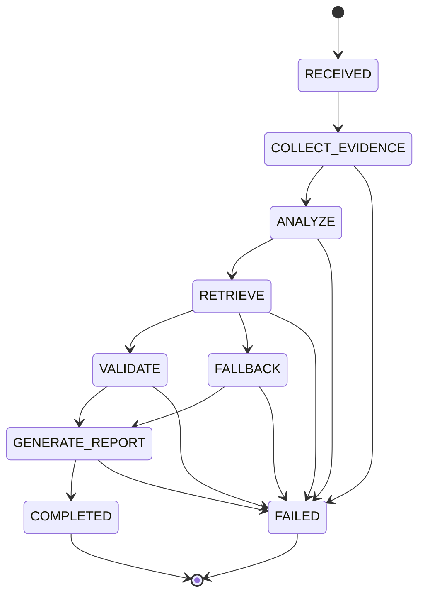

# Diagnosis Agent State Machine

## Why

Before v0.14.0, AI diagnosis was a one-shot workflow:

```text
EvidencePackage -> Retrieval -> LLM -> Report
```

That worked for the demo path, but it made the diagnosis lifecycle hard to observe and extend:

- no explicit state for the current diagnosis run
- failure stages were hard to locate
- stage duration was not visible
- future Tool Calling would be difficult to add cleanly
- retrieval, validation, and model fallback were not governed in one place

The first v0.14.0 phase adds a lightweight, single-agent state machine. It does not add LangChain, LangGraph, CrewAI, a database, multi-agent planning, or extra LLM calls.

Phase 2 keeps the same state machine and wraps deterministic business capabilities as Agent Tools. See [Diagnosis Agent Tools](diagnosis-agent-tools.md).

## State Flow



Allowed transitions are defined in `app/agent/state.py`. Terminal states are strict: `COMPLETED` and `FAILED` cannot transition back into business states.

## Context

`DiagnosisAgentContext` is the in-memory run context for one diagnosis request. It keeps:

- `requestId`
- `experimentId`
- `currentState`
- `evidencePackage`
- `analysisResult`
- `retrievedChunks`
- `validatedReferences`
- `report`
- `warnings`
- `fallbackReason`
- `errorCode`
- `errorMessage`
- `createdAt`
- `completedAt`
- `stageRecords`

The context reuses existing request, retrieval, and report models instead of copying a second EvidencePackage or DiagnosisReport model.

If the request includes `requestId`, the service reuses it. Otherwise the AI service creates a UUID. `experimentId` comes from the EvidencePackage when present and may be empty.

## Stage Records

Each agent stage writes an `AgentStageRecord` with:

- `state`
- `startedAt`
- `finishedAt`
- `durationMs`
- `status`
- `errorCode`
- `errorMessage`
- `warnings`

Supported statuses are:

- `PENDING`
- `RUNNING`
- `SUCCESS`
- `FAILED`
- `SKIPPED`

These records are intended for a future Diagnosis Agent Timeline in the frontend.

## Failure Handling

The state machine distinguishes these first-phase error codes:

- `AGENT_STAGE_FAILED`
- `RETRIEVAL_FAILED`
- `REFERENCE_VALIDATION_FAILED`
- `MODEL_PROVIDER_FAILED`

Retrieval errors use the existing fallback direction. The agent records:

```text
fallbackReason = "runbook retrieval unavailable"
```

Then it continues through `FALLBACK -> GENERATE_REPORT -> COMPLETED` and returns a rule-based fallback report.

Reference validation checks retrieved Runbook references before report generation. Model-generated `runbookReferences` are still filtered after LLM output so only references belonging to the current retrieval result are retained.

Model provider failures move the agent to `FAILED`, record the failed stage and error details, and return the existing friendly fallback report shape. The FastAPI process does not crash.

## Debug API

The AI service exposes:

```text
GET /ai/diagnosis/agent-runs/{requestId}
```

It returns the latest in-memory run summary:

- `requestId`
- `experimentId`
- `currentState`
- `createdAt`
- `completedAt`
- `stageRecords`
- `warnings`
- `fallbackReason`
- `errorCode`
- `errorMessage`

The debug store is intentionally in-memory only. It keeps the latest 100 runs, replaces the oldest run when full, and is lost when the process restarts.

## Current Limitations

- This is not multi-agent.
- There is no autonomous planning.
- There is no dynamic tool selection.
- There is no long-term memory.
- The run store is in-memory only.
- Tool execution is deterministic; dynamic Tool Selection is reserved for a later phase.
