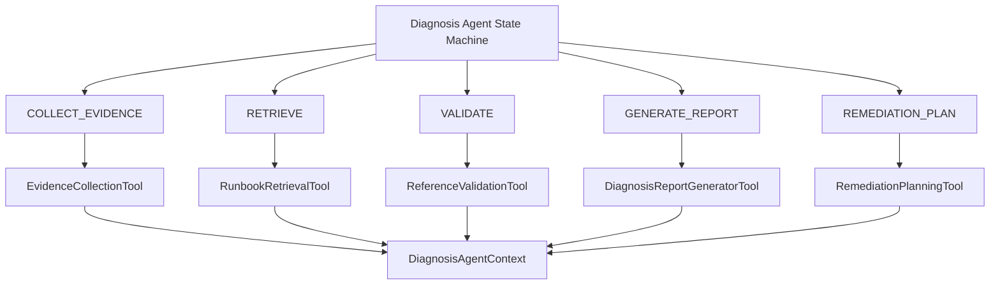

# Diagnosis Agent Tools

## Why

The v0.14.0 Phase 1 state machine made the diagnosis workflow explicit:

- workflow state
- stage duration
- fallback
- failure handling

However, the business capabilities were still directly coupled to the orchestrator. Phase 2 introduces deterministic Agent Tools for:

- Evidence
- Retrieval
- Validation
- Report Generation
- Remediation Planning

The state machine still decides the stage order. The agent does not dynamically choose tools.

## Architecture



## Tool Interface

`AgentTool` is the shared interface:

```text
name
description
execute(context) -> AgentToolResult
```

`AgentToolResult` contains:

- `toolName`
- `success`
- `data`
- `warnings`
- `errorCode`
- `errorMessage`
- `metadata`

`AgentToolCallRecord` records each call with:

- `toolName`
- `state`
- `startedAt`
- `finishedAt`
- `durationMs`
- `status`
- `inputSummary`
- `outputSummary`
- `errorCode`
- `errorMessage`
- `warnings`

`ToolRegistry` is a small dictionary-backed registry:

- duplicate tool names are rejected
- missing tool lookups fail with a clear error
- no IOC framework is introduced

## Responsibility

State Machine:

- current state
- legal state transitions
- stage lifecycle
- `FAILED` / `COMPLETED`
- stage duration

Tool:

- one concrete capability
- input handling
- output data
- tool-level error result

Orchestrator:

- chooses which tool runs in each state
- records tool calls
- writes tool output back to `DiagnosisAgentContext`
- decides whether a tool failure means `FALLBACK` or `FAILED`

Context:

- shared in-memory run data
- stage records
- tool call records
- warnings and fallback reason
- final report
- remediation plan proposal

## Remediation Planning Tool

`RemediationPlanningTool` runs after report generation and produces a structured `RemediationPlan` proposal for supported scenarios.

It is deterministic and policy-validated:

- no new LLM call
- no dynamic tool selection
- no Java Backend call
- no experiment replay from the Python Agent
- no runtime or production change

Unsupported scenarios return a successful tool result with `plan.status=UNSUPPORTED` and no actions. Invalid internally generated patches fail the tool with `REMEDIATION_PLANNING_FAILED`.

## Tool Observability

Tool calls are visible from:

```text
GET /ai/diagnosis/agent-runs/{requestId}
```

The debug response includes:

- `toolCalls`
- `toolSummary.totalCalls`
- `toolSummary.successCalls`
- `toolSummary.failedCalls`
- `toolSummary.totalDurationMs`

Tool summaries intentionally avoid API keys, full prompts, raw model responses, and full EvidencePackage payloads.

## Current Limitation

Current Tool execution is deterministic orchestration.

The agent does not:

- autonomously decide which tool to call
- dynamically plan
- use ReAct
- perform multi-round Tool Calling
- use Function Calling
- use Memory
- use multiple agents
- execute remediation plans
- run counterfactual replay from the Python Agent

Dynamic Tool Selection and Agent Planning are reserved for a later phase.
