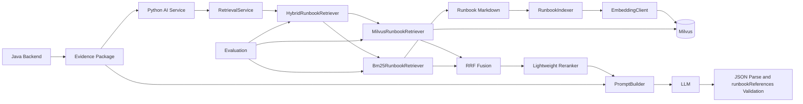
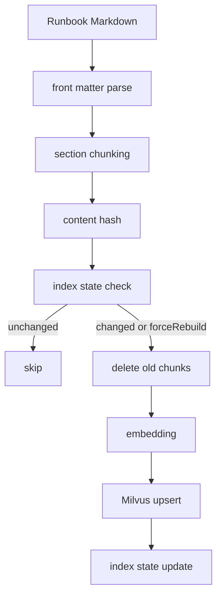
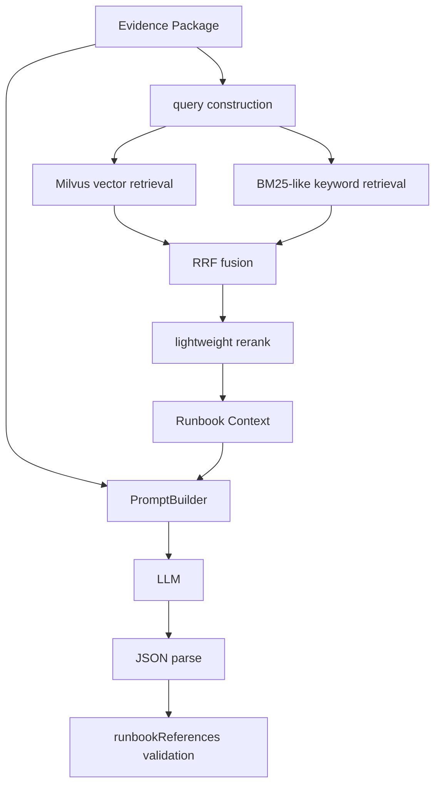
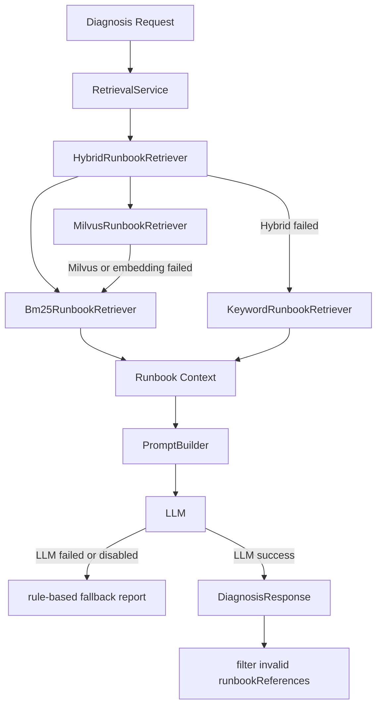

# AI FaultLab RAG Architecture

## Runbook Management and Index Task Basic

The v0.5 RAG implementation now includes local Runbook Management Basic and Index Task Basic. Runbooks remain Markdown files under `faultlab-ai-service/runbooks`; the management service validates `docId`, reads and writes only inside that directory, parses front matter and `##` sections, calculates content hashes, and joins local index state metadata.

Index task records wrap the existing `RunbookIndexer` without changing its core behavior. Each task records `taskId`, status, timestamps, duration, `forceRebuild`, counts, document lists, and `errorMessage`. The local task store is `faultlab-ai-service/data/runbook_index_tasks.json`, capped to the latest 100 records and ignored by Git.

Current scope remains intentionally small: no MySQL Runbook tables, no async queue, no RabbitMQ indexing task, no permission system, no audit log, and no version approval workflow.

## v0.8 Retrieval Tuning

The v0.8 tuning pass keeps the same retrieval architecture and focuses on Runbook keywords plus query construction. Runbook Markdown now includes more section-level metric names and English aliases for miss cases, while preserving `docId`, `faultType`, and section titles used by strict evaluation refs.

`query_builder.py` now builds query text from stable Evidence Package fields: `faultType`, `faultName`, `reason`, `evidence`, `suggestions`, metrics, and trace summary slow/error span signals. It also performs basic empty-field handling, deduplication, and length control. BM25-like retrieval uses this same query text for term extraction so CLI evaluation, debug, hybrid fallback, and Milvus query construction stay aligned.

This is still BM25-like keyword retrieval, not standard BM25, and the reranker remains lightweight and rule-based rather than a real rerank model.

## v0.9 Cache Runbooks

v0.9.0 adds three cache failure Runbooks under `faultlab-ai-service/runbooks`:

- `cache-penetration.md` for `CACHE_PENETRATION`
- `cache-breakdown.md` for `CACHE_BREAKDOWN`
- `cache-avalanche.md` for `CACHE_AVALANCHE`

Each cache Runbook uses the same six sections: `现象`, `核心指标`, `常见原因`, `排查步骤`, `修复建议`, and `风险提示`. Front matter keeps strict `docId`, `faultType`, and keywords that include Java backend metric fields such as `cache.db.query.count`, `cache.rebuild.count`, and `cache.unavailable.count`.

The front matter parser supports both the existing comma-separated `keywords:` format and YAML-style keyword lists. No new dependency is introduced.

The retrieval architecture is unchanged: Evidence Package input is converted into query text, BM25-like retrieval reads local Markdown chunks, Milvus retrieval uses indexed embeddings when available, Hybrid combines both with RRF and lightweight rule-based rerank. BM25-like is still not standard BM25, and lightweight rerank is still not a model-based reranker.

The next v0.8 tuning step adjusts only explainable scoring rules. `Bm25RunbookRetriever` boosts matched `faultType`, section title terms, front matter keywords, content terms, metric names, and evidence keys, then applies light section length normalization. `LightweightRunbookReranker` keeps RRF output intact and adds small intent-based boosts for root-cause, remediation, metric, troubleshooting, and risk-oriented sections. RRF still owns rank fusion and `docId + section` de-duplication; rerank only reorders fused chunks.

本文档描述 AI FaultLab 当前 v0.5 RAG Demo 的架构。它强调当前已经实现的工程链路、降级策略和评测能力，也明确当前不是生产级知识管理平台。

## 1. 总体架构



核心思路：

- Java Backend 负责产生 Evidence Package。
- Python AI Service 负责 Runbook retrieval、Prompt 构造、LLM 调用和引用校验。
- Runbook Markdown 是当前知识源。
- Milvus 保存 Runbook chunk embedding。
- Hybrid retrieval 同时使用向量召回和关键词召回。
- Evaluation 独立评测 retrieval，不调用 LLM。

## 2. 离线索引阶段架构图



索引阶段由 `RunbookIndexer` 驱动。当前设计是显式调用索引接口，而不是服务启动时自动索引。这样可以避免 AI Service 启动依赖 Milvus 和 embedding 服务，也方便演示 hash skip、force rebuild 和旧 chunk 清理。

## 3. 在线检索阶段架构图



在线阶段输入不是用户自由问题，而是 Java Backend 组装的 Evidence Package。检索 query 来自 ruleResult、metrics、trace summary 和 scenarioCode。

Runbook Context 会作为 JSON 注入 Prompt。LLM 只能基于 Evidence Package 和 Runbook Context 生成固定结构的 `DiagnosisResponse`，并且 `runbookReferences` 最终还会被服务端二次过滤。

## 4. Fallback 架构图



降级策略：

- Milvus 失败时，Hybrid 内部仍尝试 BM25-like keyword retrieval。
- Hybrid 整体失败时，`RetrievalService` fallback 到 `KeywordRunbookRetriever`。
- LLM 失败、关闭或 API Key 缺失时，workflow fallback 到 rule-based report。
- 非法 `runbookReferences` 会被过滤，只保留本次召回结果中的 `docId + section`。

## 5. 关键模块职责

### RunbookIndexer

负责离线索引编排：读取 Markdown、切分 chunk、计算文档 hash、判断是否跳过、调用 embedding、写入 Milvus、更新索引状态。

### IndexStateStore

负责保存本地 JSON 索引状态。当前不是 MySQL 表，也不是多实例共享状态。它记录文档 hash 和 chunk id，用于 unchanged skip、文档变更重建和 stale chunk 清理。

### MilvusStore

负责 Milvus collection schema、upsert、delete 和 search。当前默认 embedding dimension 是 1024，metric type 是 COSINE。

### EmbeddingClient

负责调用阿里云百炼 OpenAI-compatible embedding API。当前默认模型是 `text-embedding-v4`。

### RetrievalService

诊断 workflow 面向 retrieval 的入口。默认使用 `HybridRunbookRetriever`，异常时 fallback 到 `KeywordRunbookRetriever`。

### HybridRunbookRetriever

同时调用 Milvus vector retriever 和 BM25-like keyword retriever，对两路结果做 RRF fusion，再执行 lightweight rerank。

### Bm25RunbookRetriever

读取本地 Markdown chunk，基于 ruleResult、metrics 和 trace summary 提取词项，执行 BM25-like keyword scoring。它不是标准搜索引擎级 BM25。

### fusion.py

实现 Reciprocal Rank Fusion。RRF 基于排名融合多路结果，避免直接混合不同检索器不可比的 score。

### reranker.py

实现 lightweight rule-based rerank。当前根据 faultType、重要 section、evidence 命中、metric 命中、双路召回等规则加权，不调用真实 rerank 模型。

### PromptBuilder

把 Evidence Package、trace summary 和 Runbook Context 注入 Prompt，并要求 LLM 只输出严格 JSON。

### RetrievalEvaluator

加载 `evaluation/rag_eval_cases.json`，构造 retrieval request，分别评测 `bm25`、`milvus`、`hybrid`，计算 Hit@K、Recall@K、MRR。

### ReportGenerator

把一个或多个 `RetrievalEvalSummary` 转成 Markdown 报告，包含整体指标、横向对比、按 faultType 分组、case 明细、miss case 和规则型优化建议。不调用 LLM，不调用 retriever。

## 6. 当前配置

关键默认配置来自 `faultlab-ai-service/app/config.py`：

```text
embedding_model = text-embedding-v4
embedding_dimension = 1024
retrieval_mode = hybrid
hybrid_rrf_k = 60
hybrid_vector_top_k = 5
hybrid_bm25_top_k = 5
retrieval_top_k = 3
rerank_enabled = True
```

Milvus 默认：

```text
milvus_host = localhost
milvus_port = 19530
milvus_collection_name = faultlab_runbook_chunks
milvus_metric_type = COSINE
```

## 7. 工程取舍

### Markdown 而不是管理后台

当前 Runbook 数量少，结构清晰，用 Markdown 可以直接 Git 管理、审查和回滚。管理后台是后续能力，不在 v0.5 范围内。

### section chunking 而不是复杂语义切分

Runbook 本身是结构化排查手册，二级标题 section 是天然语义单元。当前阶段优先保证 chunk 可解释、引用可追溯。

### 本地 JSON index state 而不是 MySQL 表

v0.5 目标是验证索引治理闭环。本地 JSON 足够表达 content hash、chunk id、skip 和 stale cleanup。多实例共享状态属于后续生产化方向。

### 显式索引接口而不是启动自动索引

索引依赖 Milvus、embedding API 和网络。启动时自动索引会拖慢服务启动，并放大外部依赖失败对服务可用性的影响。

### BM25-like 而不是标准 BM25

当前实现是依赖少、易读、可演示的 keyword scoring。它包含 TF、IDF、长度归一化和字段加权，但不等同于完整搜索引擎级 BM25。

### rule-based rerank 而不是真实 rerank 模型

当前 rerank 不调用模型，避免引入额外依赖和调用成本。它的目标是用工程规则改善排序，而不是替代专业 rerank 模型。

### RRF 而不是直接 score 加权

向量检索分数和关键词检索分数尺度不同，直接加权容易不稳定。RRF 基于排名融合，更适合当前多路召回 demo。

### 不引入 LangChain / LangGraph

当前链路是固定 workflow，不是自由 Agent。直接实现 retrieval、prompt、parse、fallback 更容易控制行为、测试和边界。
